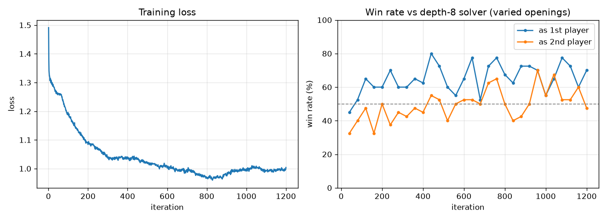
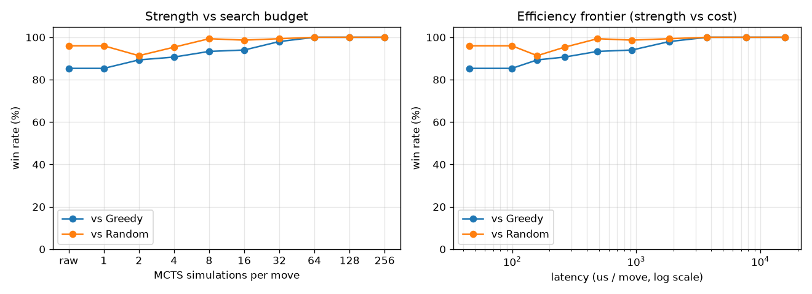

# mancala-rl

A from-scratch, AlphaZero-style agent that learns to play Kalah (capture
Mancala) entirely by playing against itself. A small policy + value network
guides a Monte-Carlo tree search; the search produces stronger moves than the
network alone; the network is then trained to imitate the search. Repeating that
loop, with no human games and no hand-written strategy, produces an agent that
out-rates alpha-beta search to depth 10 in a round-robin tournament.

Every number in this document comes from the evaluation harness in this repo —
tournaments, confidence intervals, and an exact solver — not from intuition or a
single cherry-picked game. The commands to reproduce each result are in
[The codebase, and how to run it](#3-the-codebase-and-how-to-run-it).

---

## 1. What this is, and how it got here

### The game

Kalah is the best-known member of the Mancala family. This project plays
**Kalah(6, 4)**: six pits and one store per side, four seeds in each pit at the
start.

```
        G    H    I    J    K    L
    [ 4 ][ 4 ][ 4 ][ 4 ][ 4 ][ 4 ]   P2 store [ 0 ]
    [ 4 ][ 4 ][ 4 ][ 4 ][ 4 ][ 4 ]   P1 store [ 0 ]
        A    B    C    D    E    F
```

On your turn you pick up all the seeds in one of your pits and sow them one per
pit, counter-clockwise, skipping the opponent's store. Two rules give the game
its tactics:

- **Extra turn:** if your last seed lands in your own store, you move again.
- **Capture:** if your last seed lands in one of your own pits that was empty,
  you capture that seed and everything in the pit directly opposite, into your
  store.

The game ends when one player's pits are all empty; the other player banks their
remaining seeds, and the larger store wins. This repo implements the
**empty-capture** variant (a capture fires whenever you land in your own empty
pit, even if the opposite pit is empty) — see [Ground truth](#ground-truth-why-this-exact-variant)
for why that specific choice matters.

### Where the project started

This is a rebuild of a school project that did not work. The first version was a
**Deep SARSA** agent that, after all its training, still could not beat its own
1-ply greedy opponent. The game engine from that project is kept (the sowing and
capture logic, ported to a clean side-effect-free interface); essentially
everything else here is new. The specific reasons the first version failed, and
how each is addressed here, are in the [Post-mortem](#5-post-mortem--what-i-learned).

### What it is now

The goal of the rebuild was a genuinely strong agent whose strength could be
**measured against ground truth**, not asserted. That goal drove two decisions:

1. Replace the value-bootstrapping SARSA approach with the AlphaZero self-play
   loop (network + search, trained on real game outcomes).
2. Use the exact variant of Kalah(6, 4) that has been **solved** in the
   literature, so there is a known-correct answer to check against.

The result is an agent that wins ~99% against greedy, beats depth-8 alpha-beta
search ~63% head-to-head, and edges depth-10 search — and a test suite that
confirms the engine reproduces the game's published exact values.

### Ground truth: why this exact variant

Irving, Donkers & Uiterwijk (2000) *solved* Kalah for several sizes. For the
empty-capture variant they report exact game values — the final store margin
under perfect play, first player minus second — including:

| Game        | Exact value (first-player margin) |
|-------------|-----------------------------------|
| Kalah(6, 1) | +2  |
| Kalah(6, 2) | +10 |
| Kalah(6, 3) | +2  |
| Kalah(6, 4) | +10 |
| Kalah(6, 5) | +12 |

So Kalah(6, 4) is a **first-player win by 10**. Two consequences run through the
whole project:

- The engine in this repo has its own exact solver (alpha-beta + transposition
  table, in C). Running it on the opening of each size reproduces the values
  above — see `scripts/verify_solution.py`. That is ground truth *on our own
  code*: it confirms the rules implemented here really are the solved variant,
  rather than taking the engine's correctness on faith.
- Because the first player is winning, any "overall win rate" that averages over
  both seats is misleading near the top — perfect play is not 50/50, it is a
  first-player win. The honest way to read strength is **split by seat** (how the
  agent does as first player vs as second player) and **relative to a field**
  (Elo across many opponents), which is what the harness reports.

---

## 2. Techniques, and prior work

The agent is a faithful, small-scale implementation of AlphaZero, with two
additions specific to this game. Citations are to the papers each idea comes
from.

### Self-play reinforcement learning (the core loop)

The training loop is **AlphaZero** (Silver et al., 2018) — itself the
game-agnostic form of AlphaGo Zero (Silver et al., 2017), which learns from
self-play with no human data. The same idea is also framed as **Expert Iteration**
(Anthony, Tian & Barber, 2017): a fast "apprentice" (the network) and a slow
"expert" (tree search) improve each other. One iteration:

1. **Self-play.** The current network plays games against itself. At each move,
   an MCTS search runs and produces a visit distribution over moves; the move is
   sampled from it. For every position we store `(board, search distribution,
   eventual game outcome)`.
2. **Train.** The network is trained on those examples: the **policy head**
   toward the search's move distribution (cross-entropy), and the **value head**
   toward the game's outcome (MSE). The network learns to predict, in one
   forward pass, what the expensive search concluded.
3. **Repeat.** A better network makes a better search, which generates better
   training data, and so on.

### The network

A deliberately small multi-layer perceptron (default two hidden layers of 128
units) over a 14-feature, perspective-canonical board encoding, with two heads:
a policy logit per pit, and a single `tanh` value in [-1, 1] from the mover's
point of view. The game is tiny, so a small network is plenty — and a small
network is the entire reason training runs on a CPU (see
[Results](#4-results)). `mancala_rl/network.py`, `mancala_rl/features.py`.

### Monte-Carlo tree search with a learned prior (PUCT)

Search is MCTS guided by the network. Selection uses the **PUCT** rule from
AlphaZero, which is Rosin's (2011) predictor-augmented variant of UCT (Kocsis &
Szepesvári, 2006): the network's policy biases which branches are explored, and
the network's value replaces the random rollouts of classical MCTS. The general
MCTS framework is surveyed in Browne et al. (2012). `mancala_rl/mcts.py`.

For the ablation, this repo also includes **classical, no-network MCTS** (UCT
with random or greedy rollouts), so the contribution of the learned network can
be measured directly against search alone. `mancala_rl/classical.py`.

### Addition 1 — MCTS-Solver (exact endgame play)

Kalah games end, and the endgame is shallow enough that search frequently reaches
true terminal positions. Plain MCTS only *averages* over them. This repo adds the
**MCTS-Solver** of Winands, Björnsson & Saito (2008): when a node is a proven
win/loss/draw, that proof is propagated up the tree (min/max on the mover), and
the agent will always take a move that is *proven* to win when one exists. This
makes the agent play the endgame exactly, instead of approximately.
`mancala_rl/mcts.py`.

### Addition 2 — score-margin value target

Standard AlphaZero trains the value head on a win/loss/draw bit. In a game that
is a *first-player win*, that signal saturates: from a winning position almost
everything looks like +1, so the network cannot tell a safe, decisive line from
one that wins by a single seed. The fix, which is the single change that broke a
long training plateau, is to train the value head on the **final score margin**
(squashed to [-1, 1]) instead of the win/loss bit. A scored target gives a much
richer gradient and rewards converting an advantage cleanly.
`mancala_rl/features.py` (`margin_value`), `mancala_rl/selfplay.py`,
`mancala_rl/training.py`.

### Explored, but did not make the final agent — Gumbel AlphaZero

**Gumbel AlphaZero** (Danihelka et al., 2022) replaces the root action selection
with Gumbel-Top-k sampling plus sequential halving, and uses a completed-Q policy
target. It is designed to improve policy reliably even at very low simulation
counts. It is fully implemented here (`mancala_rl/gumbel.py`) and was tested as a
drop-in for self-play. At this game's scale it **matched** plain MCTS at an equal
budget rather than beating it, so it is kept as a documented, tested alternative
rather than the default. (See [What helped, and what didn't](#what-helped-and-what-didnt).)

### The exact solver, and the test oracle

Two independent "correct answers" back up the measurements:

- **`csolver/` (C):** alpha-beta with a transposition table (FNV-hashed),
  move ordering, and futility bounds. Strong enough to solve the full Kalah(6, 4)
  opening (it reproduces +10). Used both as the ground-truth check
  (`verify_solution.py`) and, depth-limited, as a tunable opponent of known
  strength (`CSolverBot`). `mancala_rl/csolver.py` is the Python wrapper.
- **`mancala_rl/reference.py` (Python):** a brute-force minimax used purely as a
  small, obviously-correct test oracle, so the C solver and the engine can be
  cross-checked on positions small enough to enumerate.

### References

- Irving, G., Donkers, J., & Uiterwijk, J. (2000). *Solving Kalah.* ICGA Journal 23(3), 139–147.
- Silver, D., et al. (2017). *Mastering the game of Go without human knowledge.* Nature 550, 354–359. (AlphaGo Zero)
- Silver, D., et al. (2018). *A general reinforcement learning algorithm that masters chess, shogi, and Go through self-play.* Science 362, 1140–1144. (AlphaZero)
- Anthony, T., Tian, Z., & Barber, D. (2017). *Thinking Fast and Slow with Deep Learning and Tree Search.* NeurIPS. (Expert Iteration)
- Winands, M., Björnsson, Y., & Saito, J. (2008). *Monte-Carlo Tree Search Solver.* Computers and Games.
- Danihelka, I., Guez, A., Schrittwieser, J., & Silver, D. (2022). *Policy improvement by planning with Gumbel.* ICLR. (Gumbel AlphaZero)
- Rosin, C. (2011). *Multi-armed bandits with episode context.* Annals of Mathematics and AI. (PUCB / PUCT)
- Kocsis, L., & Szepesvári, C. (2006). *Bandit based Monte-Carlo Planning.* ECML. (UCT)
- Browne, C., et al. (2012). *A Survey of Monte Carlo Tree Search Methods.* IEEE TCIAIG.

---

## 3. The codebase, and how to run it

### Layout

```
mancala_rl/            the library
  engine.py            game rules; immutable State (reset / legal_moves / step)
  features.py          board encoding + the score-margin value mapping
  network.py           policy + value MLP, plus PolicyBot (raw-network player)
  mcts.py              network-guided MCTS with terminal-proof propagation (MCTS-Solver)
  gumbel.py            Gumbel AlphaZero search (implemented; explored alternative)
  classical.py         no-network MCTS (UCT + rollouts) for the ablation
  bots.py              random and 1-ply greedy baselines
  selfplay.py          self-play data generation (MCTS and Gumbel; parallel)
  training.py          one training step (policy + weighted value loss)
  evaluate.py          match harness: win rate + 95% CI, seat-swapped
  csolver.py           Python wrapper around the C solver (exact + depth-limited)
  reference.py         brute-force minimax (small, obvious test oracle)
csolver/               the exact solver in C (alpha-beta + transposition table) + build.ps1
scripts/               entry points (training, evaluation, plots, play)
tests/                 correctness tests (engine, features, mcts, csolver, ...)
assets/                generated figures used in this README
pyproject.toml         package metadata; enables `pip install -e .`
```

### Install

```sh
pip install -e .        # installs the package + deps (numpy, torch, matplotlib)
```

This is an editable install, so `import mancala_rl` works from anywhere and the
scripts run without any `sys.path` juggling. The CPU build of PyTorch is fine —
the network is small. For an NVIDIA GPU build (e.g. CUDA 12.8), install torch
first, then the package:

```sh
pip install torch --index-url https://download.pytorch.org/whl/cu128
pip install -e .
```

### Build the C solver

The exact/depth-limited solver is a small C file compiled to a shared library.
It needs `gcc` on PATH (the build script falls back to a WinLibs install if it
finds one):

```sh
powershell csolver/build.ps1        # produces csolver/mancala_solver.dll
```

The C source is committed; the built `.dll`/`.so` is not (see `.gitignore`).
If the solver is not built, the pure-Python parts still run; the scripts that use
`CSolverBot` are the ones that need it.

### Train

Pure self-play. Speed comes from running self-play across CPU cores
(`--workers`); the GPU does not help a network this small.

```sh
python scripts/train.py --iterations 400 --sims 256 --workers 8 --out runs
```

Each iteration runs self-play, extends a replay buffer, and trains. Every
`--eval-every` iterations it measures the real signal (a seat-split vs the
solver) and saves `best.pt` whenever the solver score improves, so drift cannot
discard a good network. Outputs under `--out`: `champion.pt` (latest),
`best.pt` (best vs solver), and `training_log.csv`.

Useful flags:

| Flag | Meaning |
|------|---------|
| `--sims` | MCTS simulations per move during self-play |
| `--hidden` / `--layers` | network width / depth (default 128 × 2) |
| `--value-weight` | weight on the value loss relative to the policy loss |
| `--gumbel` / `--gumbel-m` | use Gumbel self-play (pair with a low `--sims`) |
| `--solver-depth` / `--solver-games` | the in-training evaluation opponent |
| `--workers` | self-play worker processes (1 = serial) |

### Evaluate

```sh
# Round-robin Elo across a field of opponents, split by seat, written to CSV.
# --classical adds no-network MCTS, which is the network-vs-search ablation.
python scripts/tournament.py --champion runs/best.pt --games 50 --classical

# High-game-count win rates (with 95% CIs) vs random, greedy, and the solver.
python scripts/evaluate_agent.py --champion runs/best.pt --games 1000 --sims 100

# How deep a solver the agent beats, as first player vs as second player.
python scripts/depth_sweep.py --champion runs/best.pt --depths 4 6 8 10 12

# Sanity baselines (mirror matches land near 50%; greedy-vs-random reference line).
python scripts/run_baselines.py

# The solver's own strength-by-depth and wall-clock cost.
python scripts/measure_csolver.py
```

### Confirm the solved values

```sh
python scripts/verify_solution.py --max-n 4        # reproduces +2 / +10 / +2 / +10
```

`--max-n` controls how far it goes; larger sizes are dramatically harder, so it
stops once a single solve exceeds the time budget.

### Play it yourself

```sh
python scripts/play.py                    # you are player 1; agent searches 256 sims
python scripts/play.py --seat 2 --sims 400
```

A terminal board is drawn each turn; type the letter of one of your pits to sow
it (`q` quits). After each agent move it prints the value head's read of the
position, so you can see what it thinks of its chances.

### Figures and tests

```sh
python scripts/plot_training.py     --log runs/training_log.csv      # assets/training_curve.png
python scripts/strength_vs_search.py --champion runs/best.pt          # assets/strength_vs_search.png
python scripts/size_sweep.py        --champions runs_h16/best.pt ...  # raw strength vs model size

pytest                                                                # the correctness suite
```

---

## 4. Results

### Round-robin Elo

The headline measurement is a round-robin tournament: every agent plays every
other, seat-swapped, with randomized openings, and the results are fit to Elo
(Bradley-Terry MLE). The pool deliberately spans different *algorithms*, so the
rating means something relative to a spread of strategies. The learning agent
(network + MCTS) finishes first, ahead of alpha-beta search to depth 10:

| Agent | Elo |
|---|---|
| **Network + MCTS (this agent)** | **1808** |
| alpha-beta depth-10 | 1780 |
| alpha-beta depth-8 | 1679 |
| alpha-beta depth-6 | 1611 |
| alpha-beta depth-4 | 1544 |
| raw network (no search) | 1298 |
| greedy (1-ply heuristic) | 1276 |
| random | 1004 |

Head-to-head, it beats greedy ~99%, depth-8 search ~63%, and edges depth-10
~52%. Reproduce with `scripts/tournament.py`.

### Is it the learning, or just the search?

A fair question for any AlphaZero-style result: how much of the strength is the
learned network, and how much is just "MCTS is strong"? The ablation isolates
this by replacing the network with nothing — classical UCT plus rollouts — at the
**same 800-simulation budget**:

> At equal search budget, network + MCTS beats no-network MCTS by **~200 Elo**
> (~77–79% head-to-head).

So the learned network earns the majority of the strength; the search alone tops
out around depth-6 play. Reproduce with `scripts/tournament.py --classical`.


*Left: training loss. Right: win rate vs the depth-8 solver, split by seat, over
iterations. The seat split is the honest view — this is a first-player-win game,
so the two seats should not, and do not, converge to the same line.*

### How strength is measured

Three deliberate choices keep the numbers trustworthy:

- **Seat-split, not a single average.** Because Kalah(6, 4) is a first-player
  win, every match is reported as the agent's score *as player 1* and *as player
  2* separately. An aggregate near 50% against a strong opponent is expected and
  not a failure; the seat split shows offense (converting the won seat) and
  defense (holding the lost seat) independently.
- **A field, plus confidence intervals.** Strength is placed by Elo across a pool
  of opponents, and direct matchups are reported as win rates with 95% Wilson
  intervals (`mancala_rl/evaluate.py`), over hundreds to thousands of games.
- **Randomized openings.** Self-play and evaluation both start from a few random
  opening plies, so a metric is not a near-deterministic replay of one line.
- **An exact reference.** The solver gives a fixed, known-strength opponent at
  each depth, and `verify_solution.py` confirms the engine matches the published
  solved values.

### Strength vs search budget — the efficiency frontier

The same network can be run at any number of simulations, which trades strength
against per-move latency. Mapping that curve (from raw network at 0 sims up to
full search) shows how much strength each extra bit of compute buys, and where
the useful operating points are.


*From the opening: win rate and per-move latency vs MCTS budget. The raw network
(no search) already plays near greedy in microseconds; a modest search budget
captures most of the available strength.*

This is where the small network pays off: because the raw policy head already
absorbs much of what the search concludes, a lightweight agent is genuinely
strong, and the full-strength configuration still runs comfortably on a CPU.

### What helped, and what didn't

Measured at this game's scale (each claim is an experiment, not a guess):

- **Helped, decisively:** training the value head on the **final score margin**
  instead of a win/loss bit. This is what broke a long loss plateau and produced
  the agent above.
- **Helped:** the MCTS-Solver (exact endgame), and a cosine learning-rate decay
  (a fixed rate plateaued the loss around 1.42).
- **Did not help here:** Gumbel AlphaZero (tied plain MCTS at equal budget), more
  self-play simulations (64 ≈ 384), and a bigger network (strength saturates;
  see `scripts/size_sweep.py`). The ceiling here is the network and the game's
  small size, not the amount of compute — which is also why none of the tuning is
  bottlenecked on a GPU.

---

## 5. Post-mortem — what I learned

The first version of this project (Deep SARSA) never beat its own greedy
opponent. Four concrete causes, each fixed by construction in this rebuild:

1. **Misaligned transitions.** It learned from the board immediately after its
   own move, not the state it actually faced on its next turn — so its value
   updates were bootstrapping off the wrong positions.
2. **The reward *was* the greedy heuristic.** It received ±1 per move on the
   store differential, so the best it could possibly learn was to imitate greedy.
   This rebuild trains on the real game outcome instead.
3. **A single fixed opponent.** It only ever saw the sliver of the state space
   that one opponent steered it into. Self-play covers far more.
4. **No replay buffer, no normalization, no search.**

And the lesson that took longest to learn, the hard way: for a *scored* game,
predict the **score**, not just win/loss — and always measure against ground
truth (an Elo field and the solved game value), because choosing the right metric
is what finally made the picture clear. Asserting that something is better is
easy; the whole point of this rebuild was to be able to *show* it.
